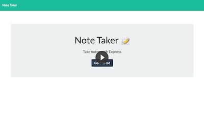

# Notes_App
  
  ## Description
  This application is intended to help save notes for later reference.
  ## Table of Contents
  1. [Installation](#installation)
  2. [Usage](#usage)
  3. [License](#license)
  4. [Contributing](#contributing)
  5. [Tests](#tests)
  6. [Questions](#questions)
  ## Installation
  To install you will need to download the files from the repository and then install the required nodes like express and moment.
  ## License
  The license type chosen for this app is:

  **NONE**

  For more details on this license type please use the following link: 
  
  https://opensource.org/licenses/
  ## Contributing
 
  ## Tests
Follow the link to the Notes App located on Heroku. Select get started and select the pencil icon at the top left. Then add a tittle for your new note and the text content for the note to be saved. Then select the disk icon at the top left to save. To delete notes select the trashcan icon next to the note you wish to delete.

  

  ## Questions
  If you have any questions please feel free to contact me via the links below: 
  * GitHub: [DanielGerrald](https://github.com/DanielGerrald)
  * E-Mail: Daniel.Gerrald@icloud.com